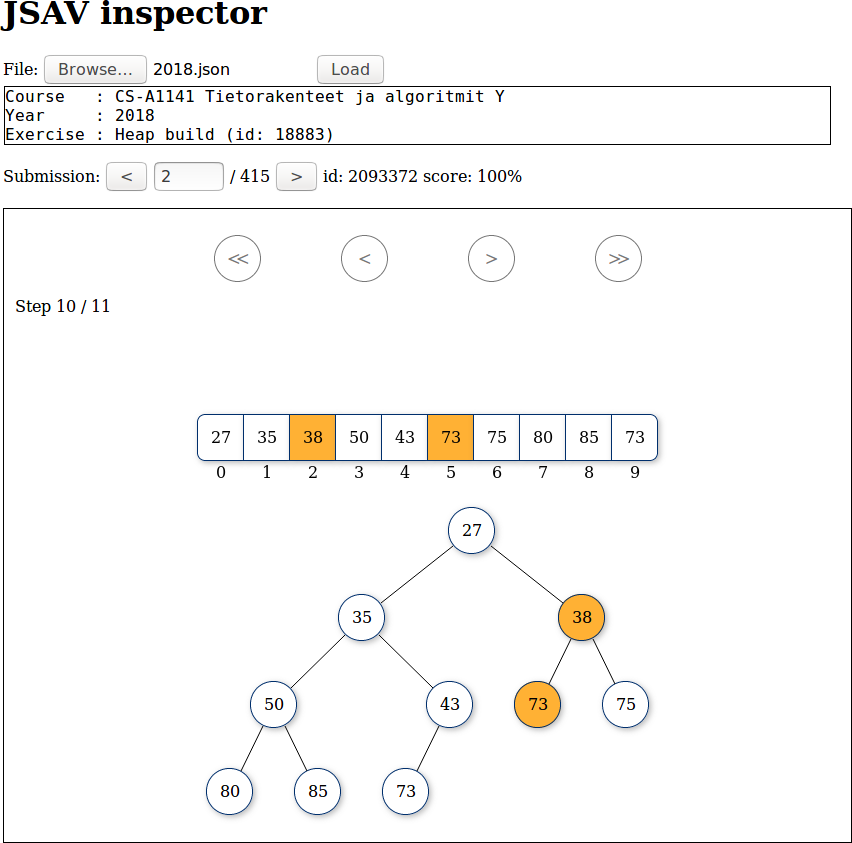

# JSAV tools

This repository contains tools for studying misconceptions in visual algorithm
simulation exercises implemented with JSAV <http://jsav.io/> and the A+ LMS
<https://apluslms.github.io/>. They are part of Artturi Tilanterä's Master's
Thesis "Automatic detection of misconceptions in visual algorithm simulation
exercises" done for Department of Computer Science at Aalto University
<https://www.aalto.fi> on years 2019-2020.

Visual algorithm simulation is a type of computerised, interactive exercise for
teaching theory of programming (algorithms). The student performs the steps of a
specified algorithm with given input data by interacting with a visual
representation of a data structure. After completing the exercise, they receive
immediate, automatic feedback on the correctness of their simulation steps.

The OpenDSA electronic textbook project contains visual algorithm simulation
exercises. <https://opendsa-server.cs.vt.edu/> These exercises are implemented
with the JavaScript Algorithm Visualisation library (JSAV).

Contact: artturi.dot.tilantera at aalto.dot.fi

## Licensing

Software          File(s)                             License
----------------------------------------------------------------------
jQuery            inspector/css/jquery-ui.min.css     MIT
                  inspector/lib/jquery-ui.min.js
                  inspector/lib/jquery.min.js
                  inspector/lib/jquery.transit.js
----------------------------------------------------------------------
JSAV              inspector/css/JSAV.css              MIT
                  inspector/lib/JSAV.js
----------------------------------------------------------------------                  
JSAV downloader   JSAV-downloader.py                  GNU GPLv3
----------------------------------------------------------------------
JSAV inspector    inspector/css/JSAV-inspector.css
                  inspector/JSAV-inspector.html
                  inspector/JSAV-inspector.js
----------------------------------------------------------------------
JSAV matcher      matcher/*
----------------------------------------------------------------------
Raphaël           inspector/lib/raphael.js            MIT

License files:
MIT:        doc/licenses/MIT-license.txt
GNU GPLv3:  doc/licenses/gpl-3.0.txt

## Software requirements

JSAV downloader requires:
- Python 3 <http://www.python.org>. (Python 3.5.2 tested)
- A running A+ LMS instance <https://apluslms.github.io/> and teacher's access
  rights to a course to download exercise submissions.

JSAV matcher requires Python 3 similar to JSAV downloader.

JSAV inspector requires a web browser with HTML5, CSS and JavaScript
support. It has been tested with Mozilla Firefox 71.0.

## JSAV downloader

File: JSAV-downloader.py

This tool retrieves JSAV exercise submissions from the A+ LMS.
It is a Python script where each *exercise instance* is specified
manually. The exercise instance is a tuple $(x, y)$, where $x$ is the
type of the exercise, such as Build-heap, $y$ is the course instance, such as
''2016'' for the respective year. Submissions from each exercise instance are
downloaded into their own JSON file.

## JSAV inspector

File: inspector/JSAV-inspector.html

This tool creates slideshows of exercise submissions. It runs in
a web browser as single, static web page, meaning that no server setup is
needed. The application is implemented in HTML5, CSS and JavaScript and it
utilises the JSAV library. The tool can open a JSON file produced with the
JSAV downloader and display students' solutions to the Build-heap exercise.

## JSAV matcher

File: matcher/*

This tool reads a file created by the JSAV downloader. It matches submissions
against known misconceptions.

## References

The following scientific publications are relevant to the topic.

Ville Karavirta and Clifford A. Shaffer. Jsav: The javascript algorithm
visualization library. In Proceedings of the 18th ACM Conference on Innovation
and Technology in Computer Science Education, ITiCSE ’13, pages 159–164,
New York, NY, USA, 2013. ACM. ISBN 978-1-4503-2078-8.
doi: http://doi.acm.org/10.1145/2462476.2462487

Ville Karavirta and Clifford A. Shaffer. Creating engaging online learning
material with the jsav javascript algorithm visualization library. IEEE Transac-
tions on Learning Technologies, 9(2):171–183, April 2016. ISSN 1939-1382.
doi: http://doi.acm.org/10.1109/TLT.2015.2490673

Ville Karavirta, Ari Korhonen, and Otto Seppälä. Misconceptions in visual algo-
rithm simulation revisited: On ui’s effect on student performance, attitudes, and
misconceptions. In 2013 Learning and Teaching in Computing and Engineering,
pages 62–69, March 2013.
doi: http://dx.doi.org/10.1109/LaTiCE.2013.35

Otto Seppälä, Lauri Malmi, and Ari Korhonen. Observations on student
misconceptions—a case study of the build – heap algorithm. Computer Science
Education, 16(3):241 – 255, 2006.
doi: http://dx.doi.org/10.1080/08993400600913523

Ari Korhonen. Visual Algorithm Simulation. PhD thesis, Helsinki University of
Technology, Department of Computer Science and Engineering, Espoo, Finland,
2003. Available via: https://learningcentre.aalto.fi/en/

Ari Korhonen, Otto Seppälä, and Juha Sorva. Automatic recognition of
misconceptions in visual algorithm simulation exercises. In 2015 IEEE Frontiers
in Education Conference (FIE). IEEE, October 2015. doi:
http://dx.doi.org/110.1109/FIE.2015.7344046
